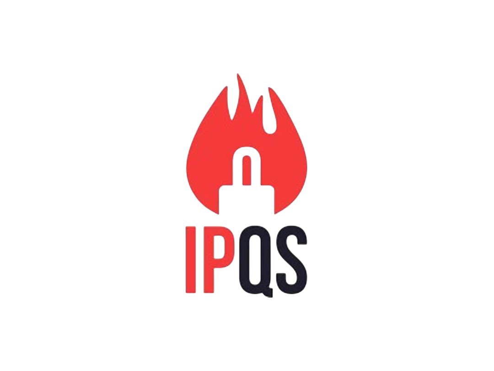
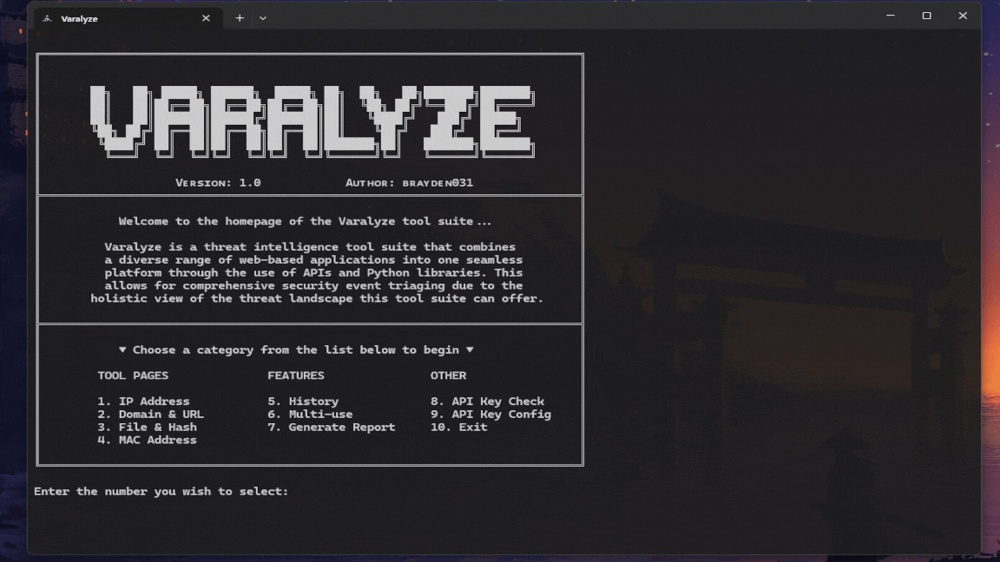

<h1 align="center">
  <picture>
    <source media="(prefers-color-scheme: dark)" srcset="https://github.com/user-attachments/assets/32b3f420-488e-47c7-aeb6-50298192b15e">
    <source media="(prefers-color-scheme: light)" srcset="https://github.com/user-attachments/assets/53d6299a-64f7-4f39-a202-cf88f30df686">
    
  </picture>

  <p align="center">
  <a href="https://hits.sh/github.com/brayden031/varalyze/">
  
  </a>
  <a href="https://github.com/brayden031/varalyze/stargazers">
    
  </a>
  <a href="https://github.com/brayden031/varalyze/commits">
    
  </a>
</p>

## Overview
**Varalyze** is a threat intelligence tool suite that combines a diverse range of web-based applications into one seamless platform through the use of APIs and python libraries. This allows for comprehensive security event triaging due to the holistic view of the threat landscape this tool suite can offer. In addition to the fundamental tools the program offers, it also provides a variety of beneficial features to users that can significantly help in aiding defensive teams. 

### Key Features
- **Threat Analysis**: Ingest data from a wide range of popular threat intelligence sources such as AbuseIPDB, VirusTotal, URLScan + more!
- **Streamline & Automation**: Streamline & Automate intelligence gathering, correlation, and reporting.
- **Comprehensive Reports**: Combine various threat intel tools to generate reports to aid security event triaging.

<br>

<div align="center">

## Tools Available

&nbsp;&nbsp;&nbsp;
&nbsp;&nbsp;&nbsp;
&nbsp;&nbsp;&nbsp;

<br>

&nbsp;&nbsp;&nbsp;
&nbsp;&nbsp;&nbsp;
&nbsp;&nbsp;&nbsp;
&nbsp;&nbsp;&nbsp;

</div>
<br>

---

## 📟 Command line 



## 🚀 Getting Started

### Prerequisites
Before using Varalyze, ensure you have the following installed:
- "*"

### Installation

1. **Clone the Repository:**
   ```bash
   git clone https://github.com/brayden-031/varalyze.git
   cd varalyze
